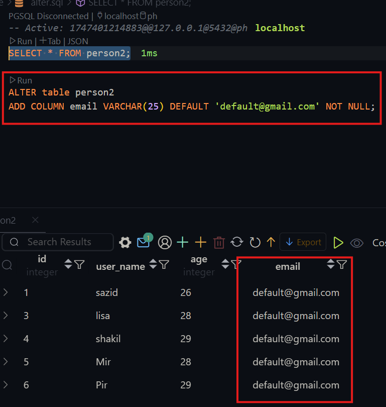
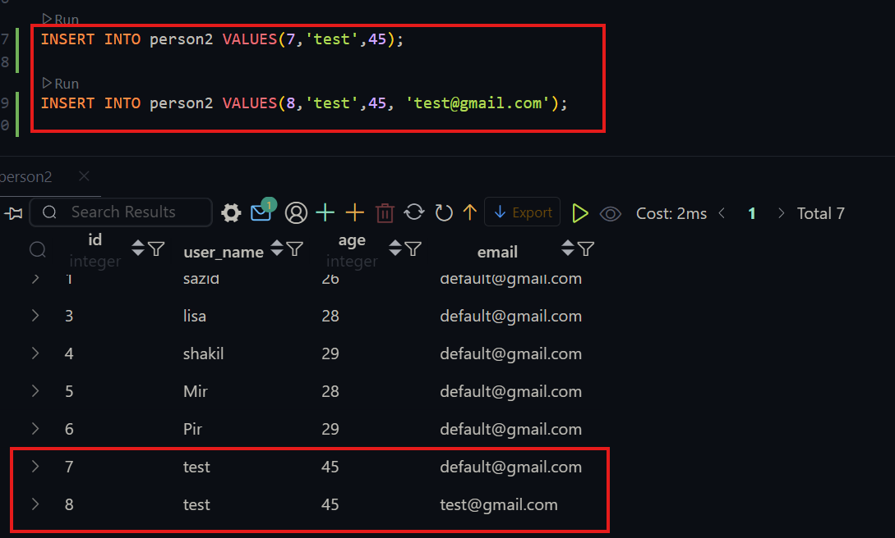
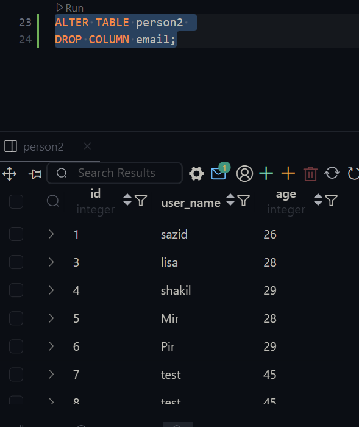
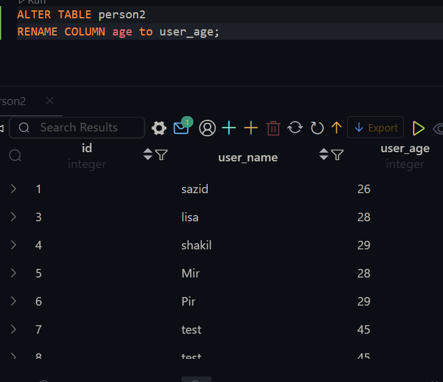

# PostgreSQL-Fundamental-and-Advanced-Data-Manipulation-Techniques

## 8-1 Using The Alter Keyword To Modify Tables and Setting Up PostgreSQl In Vscode.

### Lets learn about alter.

- By using this command we can change any structure of any existing table.
- Suppose we want to add more column or any columns constrains need to be changed or the data type needs to be changed. if we want we can remove any constrain as well. we can change column name. we will use `ALTER`,


#### Syntax of alter

```sql
ALTER TABLE table_name
action;
```


- now lets setup Postgres in Vscode


- By clicking here we can run query.


- We can select the server from here as well.


## 8-2 Expanding On the ALTER Keyword for table Modification

#### Adding a Column

```sql
ALTER table person2
ADD COLUMN email VARCHAR(25) DEFAULT 'default@gmail.com' NOT NULL;
```



- here we can not directly say that it can not be null since we are just adding the column and setting no values as well there will be no email so the default value is added as default. now we will change.

#### Inserting data

```sql
INSERT INTO person2 VALUES(7,'test',45);

INSERT INTO person2 VALUES(8,'test',45, 'test@gmail.com');
```



#### Drop a column

```sql
ALTER TABLE person2
DROP COLUMN email;
```

- as we are not dropping the whole table we are just modifying the table so we have to use drop column inside the alter.



#### Renaming a column name

```sql
ALTER TABLE person2
RENAME COLUMN age to user_age;
```

- this takes column age and make it user_age



#### Changing Data Types

```sql
ALTER TABLE person2
ALTER COLUMN user_name TYPE VARCHAR(50)
```

- This will change the varchar 20 to 50


#### Changing Constrain in existing column.

```sql
ALTER TABLE person2
ALTER COLUMN user_age set NOT NULL;
```

- This will make user_age not null
- We can use any constrain

#### Remove a Constrain from existing column.

```sql
ALTER TABLE person2
ALTER COLUMN user_age DROP NOT NULL;
```

## 8-3 Different Method To Alter Tables For Primary Key, Unique Etc

#### More Constrain Change Using ALTER

- We can not set unique, primary key, foreign key, check constrain doing alter, this will give us error. when it comes to individual column works like not null, default value setting, the alter works perfectly. unique, primary key, foreign key, check, here we can engage multiple column, so the syntax is different for these.

##### Adding Unique Constrain and dropping unique key

```sql
ALTER TABLE person2
ADD constraint unique_person2_user_age UNIQUE(user_age);
```

- here `unique_person2_user_age` is just a name so that we can remember.
- If we want to drop the unique kye constraint

```sql

ALTER TABLE person2
DROP constraint unique_person2_user_age

```

##### Adding Primary Key Constrain

```sql
ALTER TABLE person2
ADD constraint pk_person2_user_age PRIMARY KEY(user_age);
```

#### Adding Check Constrain

```sql
ALTER TABLE person2
ADD CONSTRAINT check_valid_age CHECK (user_age >= 18 AND user_age <= 100);
```

##### Like this we can also use for foreign key.

#### Using TRUNCATE

- If we want to keep the table structure but there will be no data then we will use truncate

```sql
TRUNCATE TABLE person2;
```

- if we use drop the entire table with structure will be gone.

```sql
DROP TABLE person2;
```

#### Using Select

- The `SELECT` statement is used to retrieve data from one or more tables and can be customized with `conditions`, `sorting` and other clauses. Its basically used fro data query


