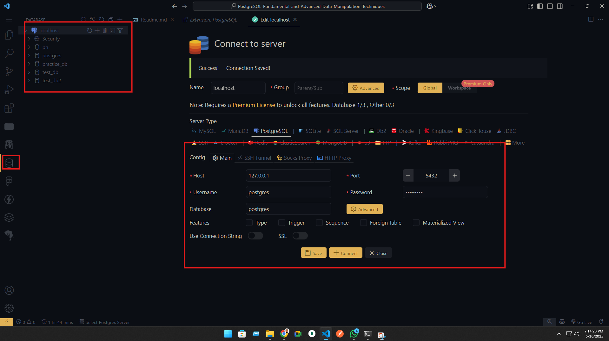
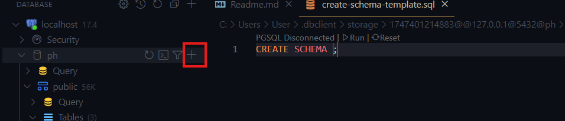
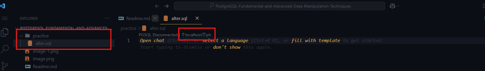
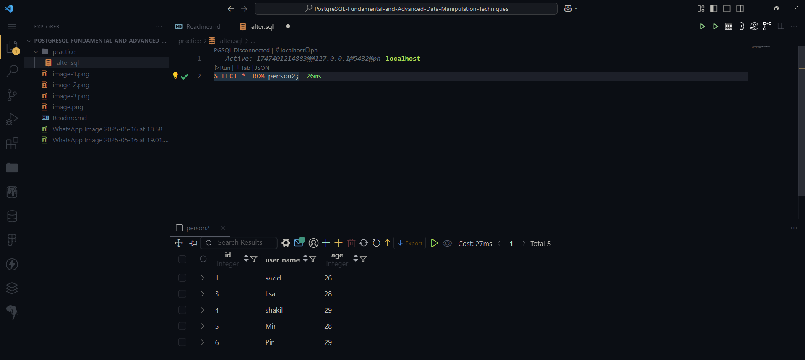

# PostgreSQL-Fundamental-and-Advanced-Data-Manipulation-Techniques

## 8-1 Using The Alter Keyword To Modify Tables and Setting Up PostgreSQl In Vscode.

### Lets learn about alter.

- By using this command we can change any structure of any existing table.
- Suppose we want to add more column or any columns constrains need to be changed or the data type needs to be changed. if we want we can remove any constrain as well. we can change column name. we will use `ALTER`,


#### Syntax of alter

```sql
ALTER TABLE table_name
action;
```


- now lets setup Postgres in Vscode



- By clicking here we can run query.



- We can select the server from here as well.




